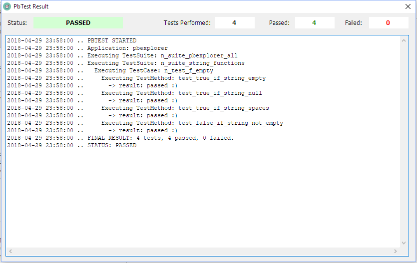

# PbTest: rough PowerBuilder Testing Framework

PbTest is a thin framework to build and run automated tests for PowerBuilder applications and objects. It takes some ideas from the xUnit frameworks, especially the PB-oriented one "PbUnit", but it is much simpler and has been rewritten from scratch.

Its basic features are:

- complete support for testsuites, testcases and testmethods
- easy to use (except a bit of initial setup)
- simple source code, easy to customize and extend
- runs well from the PB IDE and from the compiled executable
- always produces output result file
- easy to include in Continuos Integration processes (and will become even easier in the future).

## Core concepts

PbTest is aimed at testing apps. It doesn't have an independent test runner: you need to build a test target yourself and run the PbTest objects from there (anyway that's easy enough, I'll get to it in a minute).

To build tests you just create your test PBL(s) with your *test cases*, that are nvos inherited from **n_pbtestcase**; then you execute the test cases from a *test suite*, which is an nvo inherited from **n_pbtestsuite**. A test suite can also execute other test suites (not just single test cases), so you can build a complex suite hierarchy, if you want.

To start the whole testing process, in the open event of the test application object you have to instantiate the **n_pbtestapp** class and then call its **of_execute** method telling it what suite you want to execute. To be fair, you tell the of_execute method what _test app_ you are going to execute; n_pbtestapp will search for a *myapp*.test.ini file containing the name of the suite that you want to run, actually.

This mechanism lets you change the suite you want to execute at runtime by simply modifying the INI file. I preferred the INI file over a command line parameter because it is annoying to set command line parameters inside the PB IDE.

You can execute the test target (application) within the PB IDE or by running the compiled test target. PbTest generates a result text file (named *myapp*.test.result.txt) in both cases. If you execute the test inside the PB IDE, you will also get a nice window at the end with the familiar red/green bar and a count of the total/passed/failed tests.

## Basic usage

So, if for instance you want to test objects of the **myapp** application you have to do as follows.

- **Create a new target** into the same workspace of *myapp*, say **test_myapp**, in a new  **test_myapp.pbl** library. Then, edit the new target Library list by adding all the PBLs containing the objects you want to test, plus their dependencies and the **pbtest.pbl** or **pbtest.pbd** file. The easiest way is to simply include *all* the PBLs you have in the original **myapp** target/application (and the pbtest.pbl/pbd file, of course).

- Now, suppose you want to build some tests for the *f_empty* function inside your app, which simply should return TRUE if a string is null or empty; just create a test case named **n_test_f_empty** (it is mandatory to start its name with *n_test_*) by inheriting from **n_pbtestcase** and add a user event named **test_true_if_string_empty** (it is mandatory to start the event name with *test_*) with this code:

  ```
  of__assert(f_empty('') = true)
  ```

  This just means: _I expect_ (assert) _that f_empty('') will return true_. Notice the double underscore in `of__assert`: this is a convention meaning that *of__assert* is a protected/private method (public ones follow the standard PowerBuilder naming convention).

  PS. Of course you'll need the *f_empty* function somewhere in your code to save the test case. I guess you're able to write it yourself ;-)

- Now we have to create at least a suite, since PbTest executes a suite. Let's inherit from **n_pbtestsuite** and save as **n_suite_myapp_all** (it is mandatory to start its name... ok, you got it), then let's code the **ue_execute** predefined (empty) event as such:

  ```
  of__execute_test('f_empty')
  ```

  This means: *I want to execute the n_test_f_empty test case* (you can also execute suites by calling *of__execute_suite*). Re-save (remember, it's PB) and go on.

- In the new application object **test_myapp**, code the *open* event like that:

  ```
  n_pbtestapp	lnv_testapp

  lnv_testapp = create n_pbtestapp
  lnv_testapp.of_execute('myapp')

  if Handle(GetApplication()) = 0 then
  	OpenWithParm(w_pbtest_showresult, lnv_testapp.of_result_filename())
  end if
  ```
  With `lnv_testapp.of_execute('myapp')` we tell PbTest that we want to execute the test suite which is specified in the myapp.test.ini file; next we tell PbTest that if we're inside the IDE (`Handle(GetApplication()) = 0`) we want to display the result visually.

  Bonus: you can use the pbtest.ico icon for your test_myapp application object. Nice, isn't it?

- Create the **myapp.test.ini** file and put this code inside of it:

  ```
  [start]
  suite=myapp_all
  ```

  This tells PbTest that we want to execute the **n_suite_myapp_all** test suite we already created. Now everything is set up.

- Run the test by simply executing the test target inside the PB IDE: it will run and output a nice window telling you that all your test passed, something like that:
  ​
  

- In the example you see more test methods (and yes, I actually was testing an app named *pbexplorer*, and I have an "intermediate" *n_suite_string_functions* suite). You can add those to the **n_test_f_empty** object, and also create other test cases for other global function or classes, group them in suites, etc.

That's it. Oh, just forgetting: the n_testcase also have *setup* and *teardown* events which are executed before (*setup*) and after (*teardown*) all the test methods, just like in xUnit frameworks. Code them as you want (usually to instantiate/destroy the class under test and/or some required dependencies).

## My 2 cents

You can group all of your tests in whatever mode you prefer. I like to:

- create a test pbl for each of my app pbls; for instance if I have an *utilities.pbl* library I create a *test_utilities.pbl* test library;
- create a test case for each nvo or global function (that is testable);
- create one or more test method for each method of the class under test, naming it test_*result_i_expect*;
- group all the tests of a pbl in a *n_suite_pblname* test suite;
- group all the test suites in a *n_suite_appname_all* test suite;
- create whatever other suites I need to test portions of the application.